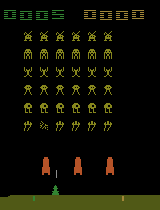
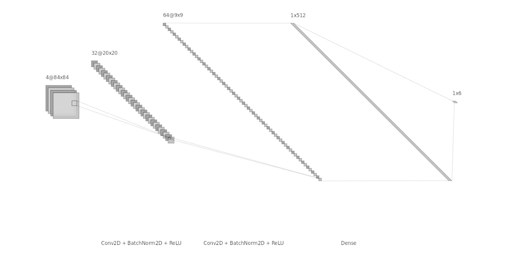
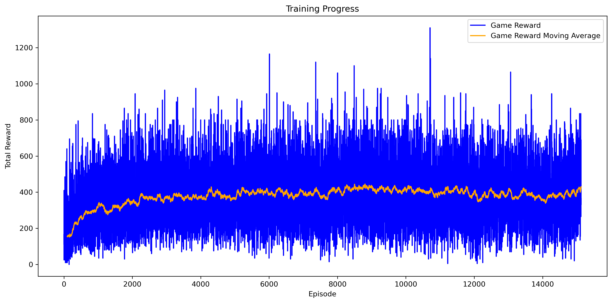

# Deep Reinforcement Learning - Space Invaders

A comprehensive Deep Q-Network (DQN) implementation for training an Agent to master Atari Space Invaders using PyTorch and OpenAI Gymnasium.

## Project Overview

This project implements a **Double Deep Q-Network (DDQN)** agent that learns to play Space Invaders through reinforcement learning.



*The trained DDQN agent demonstrating gameplay in Space Invaders*

### Features

- **Double Deep Q-Network (DDQN)** with target network stabilization  
- **Experience Replay Buffer** for improved sample efficiency  
- **Custom Reward Shaping** with life loss and missed shot penalties  
- **Metrics Tracking** with TensorBoard integration  
- **Automatic Checkpointing** and seamless training resumption  
- **Frame Stacking & Preprocessing** for enhanced state representation  
- **Epsilon-Greedy Exploration** with exponential decay scheduling  
- **Hyperparameter Optimization** using Optuna framework  
- **Visualization** tools for training analysis  

## Project Architecture

```
DeepRL_SpaceInvaders/
├── scripts/
│   ├── __init__.py                
│   ├── evaluate_agent.py          # Agent evaluation and performance testing script
│   └── watch_agent.py             # Agent gameplay visualization and GIF generation script
├── src/
│   ├── __init__.py                
│   ├── agent.py                   # DDQN Agent implementation
│   ├── environment.py             # Environment wrapper and preprocessing
│   ├── model.py                   # Neural network architecture and model definitions
│   ├── replay.py                  # Experience replay buffer implementation
│   ├── utils.py                   # Utility functions for paths and logging
│   └── training/
│       ├── __init__.py 
│       ├── train.py                # Main training script
│       ├── hyperparamoptim.py      # Main Hyperparameter optimization script
│       ├── metrics.py              # Metrics tracking and analysis
│       ├── plot.py                 # Visualization utilities
│       └── config.yaml             # Training configuration parameters
├── logs/                           # Training logs and checkpoints
├── plots/                          # Generated training and hyperparameter optimalization visualizations
├── models/                         # Saved model weights
├── requirements.txt                # Python dependencies
└── README.md                       # Documentation
```


## Setup

1. **Clone the repository:**
   ```bash
   git clone <your-repository-url>
   cd DeepRL_SpaceInvaders_project
   ```

2. **Create and activate conda environment:**
   ```bash
   conda create -n env_name python=3.10
   conda activate env_name
   ```

3. **Install dependencies:**
   ```bash
   pip install -r requirements.txt
   ```


## Usage Guide

### Training the Agent

Starting training (or resume):
```bash
python -m src.training.train
```

### Hyperparameter Optimization

Optimizing hyperparameters using Optuna (the optuna study can be opened with: optuna-dashboard sqlite:///logs/optuna/ddqn_study.db):
```bash
python -m src.training.hyperparamoptim
```

### Evaluating a Trained Agent

Evaluating the performance of a saved model checkpoint:
```bash
python -m scripts.evaluate_agent
```

### Watching the Agent Play

Rendering the agent playing Space Invaders (also saves it as a GIF):
```bash
python -m scripts.watch_agent
```

### Monitoring Training

Launching TensorBoard for real-time monitoring:
```bash
tensorboard --logdir=logs
```

## Model Architecture

### DDQN Agent Components

1. **Main Network**: Current Q-value estimation  
2. **Target Network**: Stable Q-value targets with soft updates
3. **Experience Replay**: Decorrelated sample buffer  
4. **Epsilon-Greedy**: Balanced exploration/exploitation  

### Network Architecture



---

## Performance & Results

My DDQN agent demonstrates strong performance on the Atari Space Invaders environment. Through extensive training and hyperparameter optimization, the agent consistently achieves high scores and exhibits robust gameplay strategies.

- **Sample Efficiency:** The use of experience replay and target networks accelerates learning and stabilizes training.
- **Reward Progression:** Average episode rewards increase steadily, with the agent learning to avoid unnecessary life loss and maximize shooting accuracy.
- **Generalization:** The trained agent adapts well to unseen game situations, leveraging learned policies for effective decision-making.
- **Visualization:** Training curves and evaluation metrics are available in the `plots/` directory, providing clear insights into agent improvement over time.

**Example Training Curve:**



> *The agent achieves a mean score of **420** after **8000 episodes** of training and the best average episode reward is **1249**.*

For detailed metrics and visualizations, refer to the `plots/` and 'logs/' folders.

---